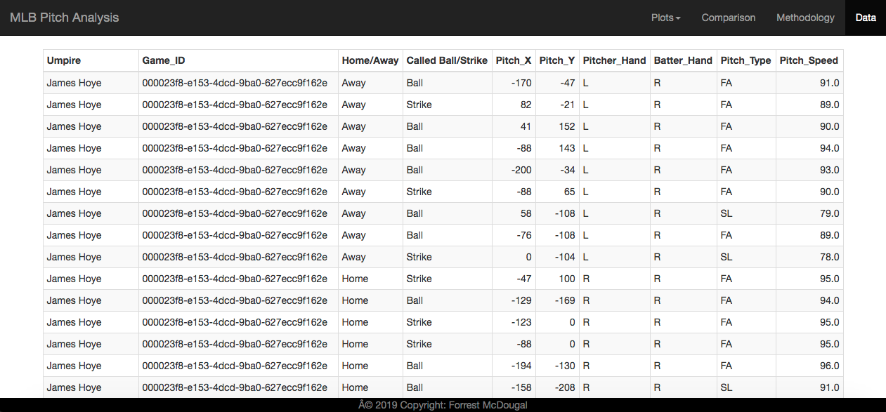

# Umpire Analysis Website (Bootstrap)
A simple website using Bootstrap to show findings from MLB Umpire analysis project [found here](https://github.com/ForrestMcDougal/MLB-Postseason-Umpire-Analysis).

## Images
### Home Page

### Plots Pages

### Comparison Page

### Methodology Page

### Data Table

## Technology used
* HTML/CSS
* Bootstrap (V3)
